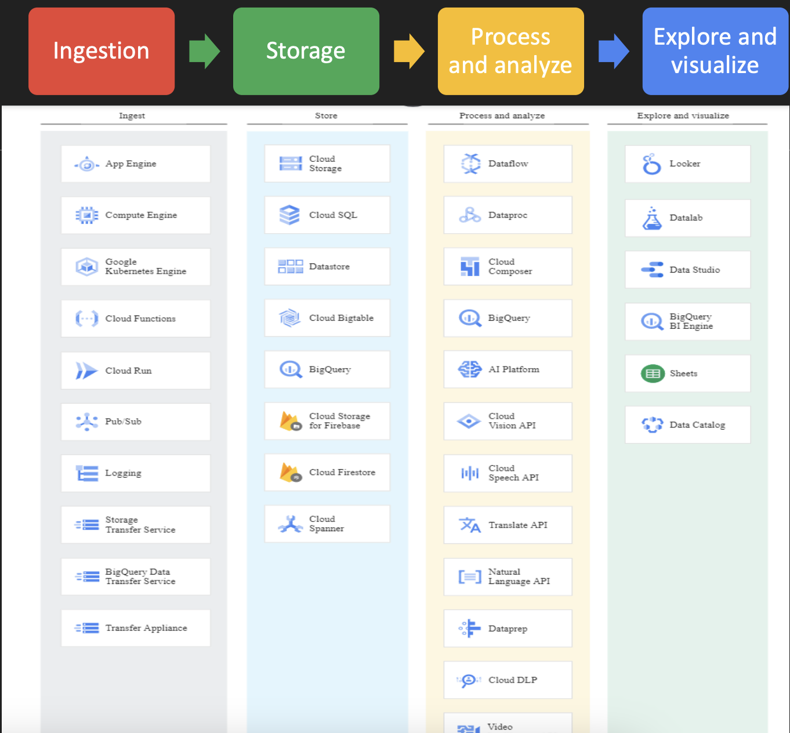
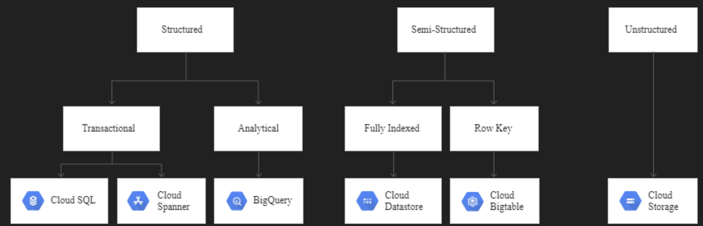
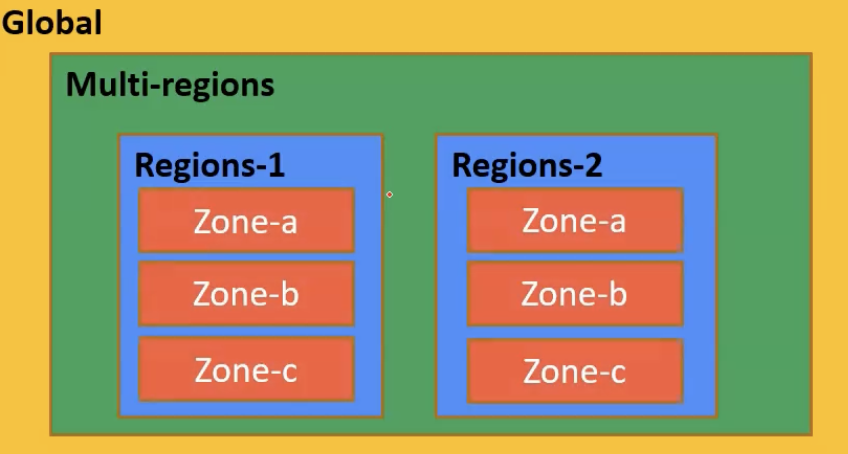
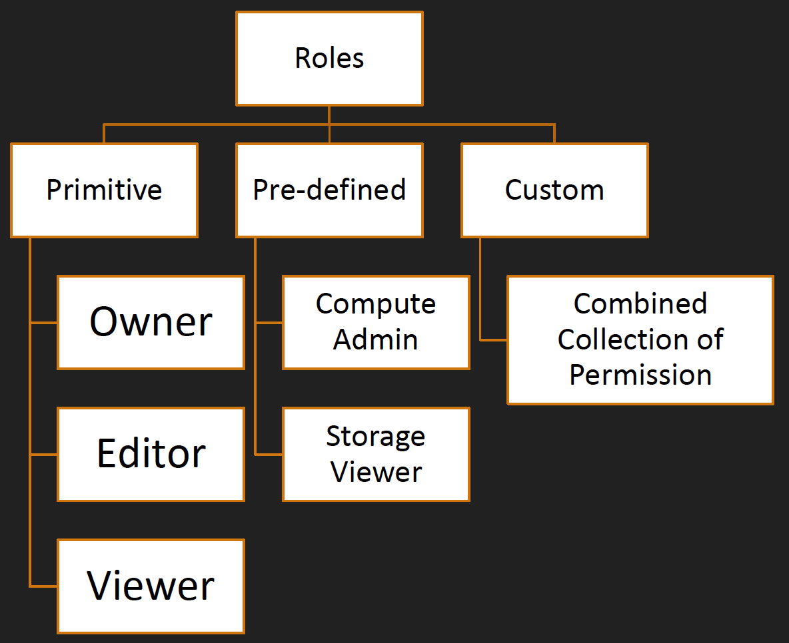
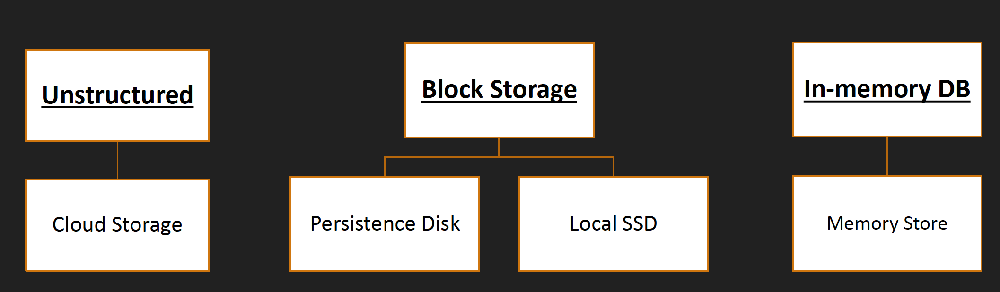

# Google Cloud Professional Data Engineer Certification
Udemy Link: https://www.udemy.com/course/google-cloud-gcp-professional-data-engineer-certification/

## Section 1: Introduction
Cost
- $0 - for GCP account.
- Free plan for the first 3 months. $300 for next 3 months.
- $200 for [certification](https://cloud.google.com/learn/certification/data-engineer). Length: 2 hours.

## Section 2: Data Engineering Concepts

### Data pipeline

There are 4 basic stages of data engineering pipeline:

#### Ingest
Gather data from mutiple sources:
- From app: Event log, click stream data, e-commerce transaction,...
- Streaming ingest: PubSub.
- Batch ingest: Different transfer services, GCS - gutil,...

#### Store
Once the data is gathered, it's time to think about how to store that ingested data.
- Cost efficient & durable data storage.
- Different kinds of data need different kinds of storage.

Ref: https://cloud.google.com/products/databases?hl=en#store

#### Process and analyze
Once data is stored in an appropriate storage, it's time to process and analyze raw data into something meaningful via:
- BigQuery.
- ML: BigQuery ML, Spark ML with DataProc, Vertex AI.

#### Explore and visualize
Other than that, we can explore and visualize data via:
- Google Data Studio: Easy to use BI Engine (Dashboard & Visualization).
- DataLab: Interactive Jupyter Notebook that supports all data science libraries.
- ML Prebuilt API: Vision API, Speech API.

### Data type

There are 3 main kinds of data:

#### Structured data
- Tabular data.
- Represented by rows and columns.
- SQL can be used to interact with data.
- Fixed schema.
- Each row has the same number of columns.
- Relational databases are structured: MySQL, Oracle SQL, PostgreSQL, MSSQL,...
- In GCP: Cloud SQL, Cloud Spanner.

#### Semi-structured data
- Each record (row) has variable number of properties (column).
- No fixed schema.
- Flexible structure.
- NoSQL kind of data.
- JSON is the main main to represent semi-structured data.
- MongoDB, Cassandra, Redis, Neo4j.
- In GCP: BigTable, DataStore, MemoryStore.

#### Unstructured data
- No pre-define structure in data.
- Image, video,...
- In GCP: Google Cloud Storage.

### Batch Data vs Streaming Data

There are 2 main ways to process data:

#### Batching
- Data size is known.
- Processing data after certain periodic interval.
- Long time to process data.

#### Streaming
- Data size is unknown.
- Data is processed as it arrives.
- No much heavy processing - take millisecond or seccond to process data.

## Section 3: GCP Fundamentals

### Regions & zones
GCP manages their services across multiple regions (Singapore, US West, ...). Inside individual region, there are multiple zones. Region is nothing but a geographical area and zone is a data center. The concept behind the region and zonze solves some of the problems:

- Low latency
- Follow government rules
- High availability
- Disaster recovery

The naming of region and zone follow pattern: `<region>-<zone>`
E.g: `northamerica-norteast1-a` means `northamerica-norteast1` region and zone `a`.

Managed location by GCP: https://cloud.google.com/about/locations

## Section 4: GCP Basic Services

### IAM
- Identify & access management
- Who can do what on which resources
- Who: identity
- What: action: create, delete,update
- Which: resources
- Roles: collection of resources

#### Roles & Permission
- Roles are collections of permissions.
- Can assign a role to an identity, but cannot assign permission directly.
- Role can be classified into 3 categroies: primitive, pre-define, custom

#### Service Account
- Account for none human: app, service.
- Service account keys can be used for authentication.
- Max 10 keys per service account.
- Max 100 service account per project.
- As other account types, service account can be assigned role into it.

### IAAS (Infrastructure As A Service)
- Google Compute Engine is the basic building block of any cloud.
- IAAS give full controle, more flexibility and more responsibility.
- Important params:
    - Zone
    - Service account
    - Machine family
    - Boot disk
    - Storage
    - Virtual Private Cloud

### PAAS (Platform As A Service)
- Google App Engine is PAAS solution.
- Fully managed service.
- Deploy web app at high scale.
- Serverless.
- Deploy HTTP based web application.
- Runtime supported: Go, Java, ...
- Two flavors:
    - Standard - basic runtime
    - Flexible - Docker container
- GAE features:
    - Auto scaling
    - Load balancing
    - Versioning
    - Traffic spliting
- GAE drawbacks:
    - Only one app of GAE per GCP project.
    - Once GAE app created, we cannot change its region.

### CAAS (Container As A Service)
- Kubernetes is the CAAS solution.
- Orchestration system for containerized application.
- Deploy an image to GKE :
    1. Create cluster
    2. Deploy workload (container image)
    3. Expose outside world

### Cloud Function
- Single purpose micro services
- Deploy code as function
- Event based triggerL
    - HTTP
    - Pub/sub
    - Object upload in Cloud Storage

## Section 5: Storage Products
Based on how the data is structured, there is an appropriate storage product for it.

## Section 6: Google Cloud Storage

### Instruction
- Object storage solution in GCP.
- Unstructured data storage:
    - Image
    - Video
    - Binary file, etc...
- Cloud storage can be used for long term archival storage.
- Can be access object over HTTP, Rest API,...
- No capacity planning required - scale to exabyte.
- Unlimited data can be stored.
- By default, data is encrypted.
- In transit, data is also encrypted.
- 0 <= Object size <= 5GB
- Object can be globally access.
- Single API to access accross multiple storage class.
- Data is geo-redundant (High Availability):
    - Multiregional
    - Dual-region storage

### Object Organization
- Bucket name is unique globally.
- Bucket name appears in URL -> careful while naming bucket.
- Bucket level lock with data retention policy.
- Object are immutable.
- Object can be versioned.

### Storage Location
1) Region
- Lowest latency within a single region.
- Replicated data across multiple zones in a single region.
2) Dual-region
- High availability and low latency across 2 regions (Paired region)
- Auto-failover
3) Multi-region
- Highest availability across continent area: US, AU, Asia,...
- Auto-failover

### Storage Class
Depends on data access frequency then choose the appropriate storage class. There are 3 storage classes:

1) Standard
- High frequency access (good for hot data)
- Storage cost: Highest
- Access cost: Lowest
- SLA:
    - 99.95% Multi/Dual
    - 99.9% Region

2) Nearline
- Low frequency access (once a month)
- Storage cost: High (lower than Standard class)
- Access cost: Fairly low (higher than Standard class)
- SLA:
    - 99.95% Multi/Dual
    - 99.9% Region

3) Coldline
- Very low frequency access (once a quarter)
- Storage cost: Fairly low (lower than Nearline class)
- Access cost: Fairly high (higher than Nearline class)
- SLA:
    - 99.95% Multi/Dual
    - 99.9% Region

4) Archive
- Offline data (once a year)
- Storage cost: Cheapest
- Access cost: Most expensive
- SLA: No SLA
