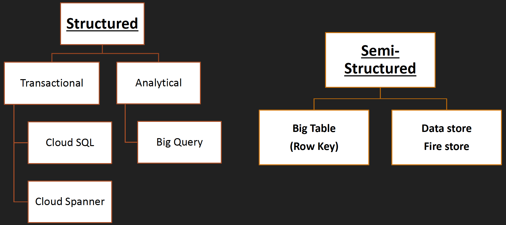

# Google Cloud Professional Data Engineer Certification
Udemy Link: https://www.udemy.com/course/google-cloud-gcp-professional-data-engineer-certification/

## Section 1: Introduction
Cost
- $0 - for GCP account.
- Free plan for the first 3 months. $300 for next 3 months.
- $200 for [certification](https://cloud.google.com/learn/certification/data-engineer). Length: 2 hours.

## Section 2: Data Engineering Concepts

### Data pipeline

There are 4 basic stages of data engineering pipeline:

#### Ingest
Gather data from mutiple sources:
- From app: Event log, click stream data, e-commerce transaction,...
- Streaming ingest: PubSub.
- Batch ingest: Different transfer services, GCS - gutil,...

#### Store
Once the data is gathered, it's time to think about how to store that ingested data.
- Cost efficient & durable data storage.
- Different kinds of data need different kinds of storage.

Ref: https://cloud.google.com/products/databases?hl=en#store

#### Process and analyze
Once data is stored in an appropriate storage, it's time to process and analyze raw data into something meaningful via:
- BigQuery.
- ML: BigQuery ML, Spark ML with DataProc, Vertex AI.

#### Explore and visualize
Other than that, we can explore and visualize data via:
- Google Data Studio: Easy to use BI Engine (Dashboard & Visualization).
- DataLab: Interactive Jupyter Notebook that supports all data science libraries.
- ML Prebuilt API: Vision API, Speech API.

### Data type

There are 3 main kinds of data:

#### Structured data
- Tabular data.
- Represented by rows and columns.
- SQL can be used to interact with data.
- Fixed schema.
- Each row has the same number of columns.
- Relational databases are structured: MySQL, Oracle SQL, PostgreSQL, MSSQL,...
- In GCP: Cloud SQL, Cloud Spanner.

#### Semi-structured data
- Each record (row) has variable number of properties (column).
- No fixed schema.
- Flexible structure.
- NoSQL kind of data.
- JSON is the main main to represent semi-structured data.
- MongoDB, Cassandra, Redis, Neo4j.
- In GCP: BigTable, DataStore, MemoryStore.

#### Unstructured data
- No pre-define structure in data.
- Image, video,...
- In GCP: Google Cloud Storage.

### Batch Data vs Streaming Data

There are 2 main ways to process data:

#### Batching
- Data size is known.
- Processing data after certain periodic interval.
- Long time to process data.

#### Streaming
- Data size is unknown.
- Data is processed as it arrives.
- No much heavy processing - take millisecond or seccond to process data.

## Section 3: GCP Fundamentals

### Regions & zones
GCP manages their services across multiple regions (Singapore, US West, ...). Inside individual region, there are multiple zones. Region is nothing but a geographical area and zone is a data center. The concept behind the region and zonze solves some of the problems:

- Low latency
- Follow government rules
- High availability
- Disaster recovery

The naming of region and zone follow pattern: `<region>-<zone>`
E.g: `northamerica-norteast1-a` means `northamerica-norteast1` region and zone `a`.

Managed location by GCP: https://cloud.google.com/about/locations

## Section 4: GCP Basic Services

### IAM
- Identify & access management
- Who can do what on which resources
- Who: identity
- What: action: create, delete,update
- Which: resources
- Roles: collection of resources

#### Roles & Permission
- Roles are collections of permissions.
- Can assign a role to an identity, but cannot assign permission directly.
- Role can be classified into 3 categroies: primitive, pre-define, custom

#### Service Account
- Account for none human: app, service.
- Service account keys can be used for authentication.
- Max 10 keys per service account.
- Max 100 service account per project.
- As other account types, service account can be assigned role into it.

### IAAS (Infrastructure As A Service)
- Google Compute Engine is the basic building block of any cloud.
- IAAS give full controle, more flexibility and more responsibility.
- Important params:
    - Zone
    - Service account
    - Machine family
    - Boot disk
    - Storage
    - Virtual Private Cloud

### PAAS (Platform As A Service)
- Google App Engine is PAAS solution.
- Fully managed service.
- Deploy web app at high scale.
- Serverless.
- Deploy HTTP based web application.
- Runtime supported: Go, Java, ...
- Two flavors:
    - Standard - basic runtime
    - Flexible - Docker container
- GAE features:
    - Auto scaling
    - Load balancing
    - Versioning
    - Traffic spliting
- GAE drawbacks:
    - Only one app of GAE per GCP project.
    - Once GAE app created, we cannot change its region.

### CAAS (Container As A Service)
- Kubernetes is the CAAS solution.
- Orchestration system for containerized application.
- Deploy an image to GKE :
    1. Create cluster
    2. Deploy workload (container image)
    3. Expose outside world

### Cloud Function
- Single purpose micro services
- Deploy code as function
- Event based triggerL
    - HTTP
    - Pub/sub
    - Object upload in Cloud Storage

## Section 5: Storage Products
Based on how the data is structured, there is an appropriate storage product for it.

## Section 6: Google Cloud Storage

### Instruction
- Object storage solution in GCP.
- Unstructured data storage:
    - Image
    - Video
    - Binary file, etc...
- Cloud storage can be used for long term archival storage.
- Can be access object over HTTP, Rest API,...
- No capacity planning required - scale to exabyte.
- Unlimited data can be stored.
- By default, data is encrypted.
- In transit, data is also encrypted.
- 0 <= Object size <= 5GB
- Object can be globally access.
- Single API to access accross multiple storage class.
- Data is geo-redundant (High Availability):
    - Multiregional
    - Dual-region storage

### Object Organization
- Bucket name is unique globally.
- Bucket name appears in URL -> careful while naming bucket.
- Bucket level lock with data retention policy.
- Object are immutable.
- Object can be versioned.

### Storage Location
1) Region
- Lowest latency within a single region.
- Replicated data across multiple zones in a single region.
2) Dual-region
- High availability and low latency across 2 regions (Paired region)
- Auto-failover
3) Multi-region
- Highest availability across continent area: US, AU, Asia,...
- Auto-failover

### Storage Class
Depends on data access frequency then choose the appropriate storage class. There are 3 storage classes:

1) Standard
- High frequency access (good for hot data)
- Storage cost: Highest
- Access cost: Lowest
- SLA:
    - 99.95% Multi/Dual
    - 99.9% Region

2) Nearline
- Low frequency access (once a month)
- Storage cost: High (lower than Standard class)
- Access cost: Fairly low (higher than Standard class)
- SLA:
    - 99.95% Multi/Dual
    - 99.9% Region

3) Coldline
- Very low frequency access (once a quarter)
- Storage cost: Fairly low (lower than Nearline class)
- Access cost: Fairly high (higher than Nearline class)
- SLA:
    - 99.95% Multi/Dual
    - 99.9% Region

4) Archive
- Offline data (once a year)
- Storage cost: Cheapest
- Access cost: Most expensive
- SLA: No SLA

### Object Lifecycle Management
- Based on condition, what action needs to perform on object.
- Conditions:
    - Object age
    - Object file type
    - After some specific date
- Action:
    - Transition to different storage class for high performance: from Standard to Nearline, from Coldline to Archive,...

### Secure Data With Encryption
There are 3 ways that we can do to ecrypt our data in GCS:
- Google managed encryption Keys
    - No configuration
    - Fully managed
- Customer managed encryption keys
    - Create keyring in Cloud KMS (Key Management Service)
    - Key will be managed by customer (Key rotation)
- Customer supplied encryption keys
    - We will generate key with command: `openssl rand -base64 32`
    - gsutil - encrypt with CSEK: `gsutil -o 'GSUtil:encryption_key='<openssl_key> cp <file> gs://<bucket>/<destination_path>`
    - We cannot open this file normally via browser, we must use `gsutil` with encryption key to access it: `gsutil -o 'GSUtil:encryption_key='<openssl_key> cat gs://<bucket>/<destination_path>`

### Object Versioning
- Help to prevent accidental deletion of object.
- Enable/Disable versioning at bucket level.
- Versioning are not enabled by default.
- Get access to older version with `<object_key>#<version_number>`.
- If we don't specify version numbner, always retrieve the latest version.
- If we don't need earlier version, delete it & reduce cost.
- To enable: `gsutil versioning set on gs://<bucket_name>`
- To see if the version is enabled or not: `gsutil versioning get gs://<bucket_name>`
- To list all files and see their version number: `gsutil ls -a gs://<bucket_name>`

### Access Control In GCS
- Who can do what on GCS at what level.
- There are 3 ways to grant permission into a bucket:
    - Apply at project level
        - Using IAM: storage predefined role or custom role.
    - Apply at bucket level
        - Uniform level access: apply for all objects inside bucket (no object level permission).
        - Fine grained permission: ACL (Access Control List) for each object separately.
    - Assign bucket level role
        - Select bucket & assign role to a user.

### Signed URL
- Give temporary access to user who does not have Google Account.
- URL expires after defined period of time.
- Max period for such URL is value is 7 days.
- Using command: `gsutil signurl -d 10m <SA_key_json_path> gs://<bucket_name>/<fipath>`

### Bucket Retention Policy
- Minimum duration for which bucket will be protected from:
    - Deletion
    - Modification

## Section 7: Data Transfer Service
There are 3 scenarios to use DTS:
- From on-premise to GCS.
- From GCS bucket to another GCS bucket.
- From another cloud platform to GCS bucket (S3 bucket to GCS bucket).

### On-premiseto GCS
There are 3 ways to do this:

1. `gsutil`:
2. Transfer Service for on-premise data:
    - Quickly and securely move data from private data centers into GCS.
    - Two steps process:
        1. Install an agent
        2. Create transfer job inside GCP
3. Transfer Appliance:
    - Physical device which securely transfer large amounts of data to GCP.
    - Need to request to Google.
    - When data that exceeds 20TB or would take more than a week to upload.

### Transfer Service
- This will quickly and securely transfer data into GCS.
- From various sources:
    - Amazon S3
    - Azure Blob Storage.
    - Move data between GCS buckets.
- Create Transfer job.
- Onetime run or recurring.

## Section 8: Google Block Storage & Filestore

### Block Storage
Block storage is similar to hard disk storage in PC/laptop. There are 2 kinds of block storages:
1. Direct attached storage - Local SSD
    - Physically attached to VM
    - Very high performance - 10x to 100x of persistence disk
    - Costlier than persistence disk
    - Cannot re-attached to other VM
    - Once VM destroy, locall SSD will be deleted.
    - Lower availability
    - Temporary/ephemeral storage
    - No snapshot
    - Let's see in action
2. Network attached storage
    - Persistence disk
    - Zonal, regional
    - Not attached directly to any VM
    - Can be re-attached with other VM
    - Very flexible - resize easily
    - Permanent storage
    - Snapshot supported
    - Cheaper than local SSD

### Filestore
Similar to NFS and we can manage the file sharing.
- Fully managed, high performance filestore
- Network attached storage (NAS) for Compute Engine and GKE instance
- Minimum 1TB, maximum 64TB
- Support for HDD and SSD
- Enterprise level - easy file sharing
- Costly compare to cloud storage
- Need to use `nfs-common` (`mount` command) to mannually attach to Filestore

### Which storage to use and when
- Cloud Storage
    - Unstructured data storage
    - Video stream, image
    - Binary data
    - Staging environment
    - Compliance
    - Backup
    - Data lake
- Filestore
    - Performance predictable
    - Lift-shift millions of files
- Persistent disk
    - Attach disk with VM & containers
    - Share read-only disk with multiple VM
    - Database storage
- Local disk
    - Attach disk with VM & containers
    - Temporary high performance attach disk

## Section 9: Database concepts
Learn some database related terminology from cloud perspective.

### OLTP (Online Transaction Processing)
- Simple query
- Large number of small trasactions
- Database modification
- Traditional RDMS: MySQL, PostgreSQL, Oracle, MSSQL
- GCP: Cloud SQL, Cloud Spanner

### OLAP (Online Analytical Processing)
- Data warehouse
- Data is collected from multiple sources
- Complex query
- Data analysis
- GCP: Google Big Query

### RTO vs RPO

- RTO: Recovery Time Objective
    - Maximum defined time for a system can be down
    - When a problem happens, engineering team must bring system back within RTO.
- RPO: Recovery Point Objective
    - Maximum time for an organization can tolorate data loss

### Durability
- How healthy & resilient your data is
- For example: Object Storage provider measure durability in terms of number of 9's (99.9999999%). That means that even with 1 billion objects, you would likely go a hundred years without losing a single one.

### Availability
- Data is replicated across multiple regions to gain higher availability.
- Availability is defined by SLA (Service Level Agreement).
- For example: SLA level of 99.99 % uptime/availability results in the following periods of allowed downtime/unavailability:
    - Daily: 8.6s
    - Weekly: 1m 0.48s
    - Monthly: 4m 21s
    - Quarterly: 13m 2.4s
    - Yearly: 52m 9.8s
- Ref: https://uptime.is/

## Section 10: GCP Database Products

### Structured data
- Cloud SQL
- Cloud Spanner
- Big Query

### Semi-structured data
- BigTable
- Datastore
- Memorystore

### Other
- Pub/sub

## Section 11: Google Cloud SQL
- Fully supported RDMS: MySQL, PostgreSQL, SQL Server
- Can easily lift & shift above database to GCP
- Regional database with 99.95% SLA
- Storage up to 30TB (if your data is beyond 30TB, Google Cloud SQL is not a good approach)
- Scale up to 96 core & 624 GB memory
- No horizontal scaling
- Data is encrypted with Google managed key or CMEK
- Cloud SQL can be accessed from anywhere like - App Engine, Compute Engine,...
- Use for storing transactional database
- Ecommerce, CRM kind application backend
- No maintenance & auto update
- Back-up database
    - On-demand backup
    - Schedule backup
- Database migration service (DMS)
    - Migrate data from different SQL system to Cloud SQL
- Point-in time recovery: can go back in a time and recover data at particular time in past
- Scale with read replicas - to transfer read workload to other instance
- Export data:
    - gcloud utility or Cloud Console
    - In SQL/CSV format

### Google Cloud SQL Failover
- Google CLoud SQL uses Active - Standby model to implement its High Availability feature.
- There are 2 instances: 1 Active and 1 Standby.
- Once Active instance goes down, the Standby one will be promoted to be Active and handle the traffic.

## Section 12: Google Cloud Spanner
- Cloud Spanner = Cloud SQL + Horizontal Scaling
- Cloud Spanner is more powerful and expensive than Cloud SQL
- Use when data volume > 2TB
- Can be scaled to Petabyte
- 99.999% availability
- Cloud native solution and specific to GCP (Lift & shift is not recommended)
- Data export
    - Cannot export with `gcloud`
    - Can export via Cloud Console or Cloud Dataflow job.
    - When export data from Spanner to GCS, Dataflow job is required

### Cloud Spanner vs Cloud SQL

- Cloud SQL:
    - Lift & shift SQL based system
    - CRM, Ecommerce app
    - Max data size is 30TB

- Cloud Spanner:
    - Horizontal scalability
    - Low latency
    - Data storage is beyond TB

## Section 13: NoSQL Instruction
- Flexible schema, number of properties is varied.
- Data model will be like:
    - Document
    - Key-value pair
    - Graph based

- To store such kinds of flexible data, GCP provides:
    - BigTable
    - Firestore & Datastore (Firestore is the next gen of Datastore)

## Section 14: Cloud Datastore
- Highly scalable NoSQL database
- Serverless
- Document kind data storage - MongoDB
- SQL Like Query - GQL
- Support ACID Transaction
- Multiple indexes
- Data replication across different region
- Use case:
    - Session info
    - Product catalog
- Export data from `gcloud` - cannot export via Cloud Console

### Cloud Datastore vs RDBMS

### Cloud Firestore
- Firestore is the next generation of Datastore
- Highly scalable NoSQL database
- Collection & Document model
- Choose 1 of 2 modes:
    - Native mode
    - Datatstore mode
- Real-time updates
- Mobile and web client libraries

### Cloud Firestore vs RDMS

**Note: Can only use Datastore or Firestore in per GCP project.**

### Section 15: Google Cloud Memorystore
- Kinda in-ram database where data is stored in primary memory
- Very fast data access
- Two supported engines:
    - Redis
    - Memcached
- Can only access via iternal IP
- High availability with 99.99% SLA
- Import data from GCS to Memorystore

### Section 16: Google Cloud BigTable
- Fully managed wide column NoSQL database
- Columns are grouped into column family
- No serverless
- Scale horizontally with multiple node
- Milisecond latency
- Handles millions of request per sercond
- How to access:
    - `cbt` - command line (part of cloud sdk)
    - HBase API
- No multi column index
    - Only `row key` based indexing
    - Design `row key` is very important:
        - Which query is frequent in application
        - No hot spotting
        - Don't use monotonically increasing key
- Seamless integration with:
    - Warehouse - BigQuery
    - Manchine Learning
- Used for:
    - Time series data
    - Financial data

## Section 17: Data Processing Product & Exploration

Data processing service that GCP provides:
- BigQuery - Analytical workload (storage + processing)
- DataFlow - Apache Beam
- DataProc - Spark, Hadoop
- DataFusion - Drag & drop pipeline (without code)
- Cloud Composer - Airflow in GCP
- DataPrep
- Cloud PubSub

## Section 18: Google Cloud BigQuery
- Data warehouse solution in GCP
- Like relational database - SQL schema
- Serverless
- Built upon BigTable + GCP Infrastructure
- BigQuery is columnar storage
- This is for analytical database, not for transactional purpose
- Exabyte scale
- Query using standard SQL
- BigQuery can query from external data source (GCS, SQL, BigTable)
- BigQuery can load data from various sources (CSV, JSON, Avro, SQL, ...)
- Query cost is very expensive: $5 per 1TB data scanned
- Before executing query, do dry run
- BQ data organization:
    - `Project -> dataset -> table`
    - `Project` is top level container in GCP
    - `Dataset` hold multiple `tables`
    - Each `table` must belong to `dataset`
    - Assign BQ related role at `organization`, `project` or `dataset` level
    - `Table` contains data and it has schema
    - `Job` is operation that is performed on BQ resources (load, query, extract, copy)

- When perform a query on a specific table for the first time, BQ will scan the actual data. Then, the result will be stored in a temporary table which is expired after 24 hours. The next run with the same query on the same table will return the the result of that temporary table instead of scanning the whole table.

### When BigQuery should be used
- When workload is analytical
- Large data volume
- For complex query which takes much execution time
- Off-load some workload from primary transaction DB
- No join is preferred (data is denormalized)

## Section 19: Google Cloud PubSub
### What is PubSub
- Fully-managed PubSub system inside Google Cloud
- Serverless
- Auto-scaling and auto-provisioning with support from zero to hundreds of GB/second
- Topic - message storage
- Publisher sends message to the topic at `pubsub.googleapis.com`
- Push&pull way to access message
- Once subscriber receives message, ACK is sent
- Cloud PubSub acts as staging environment for many GCP services

### How it work
- Fully-managed asynchronous messaging service
- Scale to billions of message per day
- Publisher - App send message to Topic
- Push & Pull way to access messages
    - Pull - Subscriber pull message
    - Push - Message will be sent to subscriber via webhook
- One topic can have multiple subscribers
- One subscriber can also have multiple topics

### Advantage of PubSub
- Durability of data will increase
- Highly scalable
- Decoupling between 2 systems (Publisher & Subscriber)
- We can enforce data which travels through a particular topic to align with predefined schema

## Section 20: Cloud DataFlow
- Managed service for variety of data processing
- An advanced unified programming model to impelement both batching and streaming that run on various execution engine/runner
- Cloud version of Apache Beam
- Serverless, fully managed by GCP
- Horizontal autoscaling of worker
- Jobs created via:
    - Pre-define template
    - Notebook instance (write data pipeline in Java, Python, SQL)
    - Cloud Shell or local machine

### How DataFlow works
- Write job in Java, Python, Go
- Unified API for both batch + stream processing so that's why we do not need to handle batch data and streaming data separately
- Execution:
    - Direct Runner (scaling issue so run on local only)
    - Apache Flink
    - Apache Spark
    - Cloud DataFlow (inside GCP)

### Apache Beam
- Pipeline
- IO Transform
- Pcollection (Fundamental data type in Beam)
- Ptransform (The operations executed within a pipeline)
- Runner (Execution engine - where Apache Beam code is executed)

## Section 21: Cloud DataProc
- Managed Hadoop & Spark Services inside GCP
- Can easilyu lift/shift existing Hadoop/Spark based job into GCP
- Supported cluster type:
    - Standard (1 master, N workers)
    - Single node (1 master, 0 workers)
    - High Availability (3 master, N workers)
- Worker node can sit in a regular VM or preemptible VM (cost reduction)
- Supported jobs: Hadoop, SparkR, Spark, SparkSQL, Hive, Pig, PySpark
- This is not a serverless --> Need to create a cloud data block cluster before hand

## Section 22: Data Fusion
- Fully managed cloud native solution to build data pipeline without code
- 150+ preconfigured connectors & transformations
- Built with open-source CDAP
- 3 editions are available:
    - Developer
    - Basic
    - Enterprise

## Section 23: Cloud Composer
- Fully managed GCP version of Apache Airflow
- Airflow is a workflow & orchestration engine
- With Airflow we can write Python code to schedule and monitor workflows (DAGs)
- Built-in integration with other GCP services
- Cloud Composer is not serverless so we need to create instance manually before hand
- Cloud Composer is deployed via K8S under the hood in GCP

## Section 24: Data Loss Prevention API
- Discover, classify and protect most sensitive data (PII data)
- Apply on GCS, BigQuery
- DLP works on any kind of data (text, structured, semi-structured and unstructured data)
- DLP will:
    - Identify sensitive info
    - De-identify data: Masking, encryption
    - Re-identify data (in case you want to recover original data from masking or encryption)
- Internally, DLP will pick a sample of data to inditify if there is a possibility the data can be sensitive.

### De-identification of data
- Remove sensitive data (Redaction)
- Replace with some token (Replacement)
- Replace one/more character with some other char (Masking)
- Encrypt sensitive data (Encryption)

### TEMPLATES
- Configuration which define for
    - Inspection of jobs (eg: find sensitive data)
    - De-identification of jobs (eg: remove sensitive data)
- Once template defined, can be reused for other jobs

### INFOTYPES
- What to scan for
    - Bult-in (eg: credit card, SSN, age, ...)
    - Stored (Custom info type based on some fixed words, regex, custom dictionary,...)

### MATCH LIKELIHOOD
- Once sensitive data is idenified, mach likelihood is how much confidence this system DLP API has:
    - LIKELIHOOD_UNSPECIFIED: Default, same as POSSIBLE
    - VERY_UNLIKELY: lowest
    - UNLIKELY: low
    - POSSIBLE: so so
    - LIKELY: high
    - VERY_LIKELY: very high

## Section 25: Data Catalog
- A place to store metadata (data of data) from multiple places.
- To understand data and find insight of existing data, Data Catalog plays an important role
- There are 2 kinds of metadata:
    - Technical metadata:
        - For BigQuery and PubSub, these metadata resides inside individual products
        - Technical metadata being registered by catalog automatically
    - Business metadata
        - Attach tag to existing data asset
        - Define some tag template and attach metadata

## Section 26 + 27: Machine Learning Basics
There are 2 types of ML:
- Supervised learning:
    - Label has been given
    - Regression
    - Classification
- Unsupervised learning:
    - No labels
    - Find structure within data

### Machine Learning Workflow

**Training process:**

    Ingest Data --> Data Preparation --> Split Data (Traning: 80 + Testing: 20) --> Apply Algorithm to Traning Data --> Model

**Testing process:**

Once model from traning process is produced, we use it with testing data for testing purpose:

    Testing data --> Model --> Predition

Once we sastify with the model, we deploy that model into production. Otherwise, go back to training process.

### Machine Learning solution in GCP
- Pre-trained model
    - For generic use cases
    - Vision API, Speech API, Language API
- Auto ML:
    - Just provide your data and leave the traning work for Google
- Custom training:
    - Full control to perform the entire ML workflow.
    - Using libraries: TensorFlow, PyTourch, Scikit-learn,...
    - Spark ML, BigQuery ML

## Section 28: Data Preparation with DataPrep
- Intelligient Data Preparation tool
- Build by Trifacta - 3rd tool, not cloud natvie
- Play with this tool without any code, just click
- Serverless - No infra to be managed
- Automatically detect schema, anomolies
- Do all time consumming tasks easily
- Concern - Need to share data with Trifacta?

## Section 29: ML APIs: Pre-built Model
- Google has already trained ML/AL algorithm to build model
- User can use `gcloud` or SDK to use the pre-trained model base on specific use cases:
    - Object recognition/detection - Vision API
    - OCR
    - Speech to text
    - Language translation
    - NLP

### Vision API
- Detect printed and handwritten text
- Detect objects
- Identify popular places and product logos
- ...

### Natural Language API
- Identify entities within documents
- Sentiment analysis
- Content classificaion

### Speech to Text API (vice versa)
- straight forward, convert speech (audio) to text and vice versa

## Section 30: Auto Machine Learning
- Unlike Pre-built model, Auto ML let us throw data to GCP then Google will train the provided data with their algorithm and find the best model for us
- Use Auto ML when we have some custom requirements
- Auto ML is a part of Vertex AI
- Once get the model, we need to deploy it and create endpoint for it
